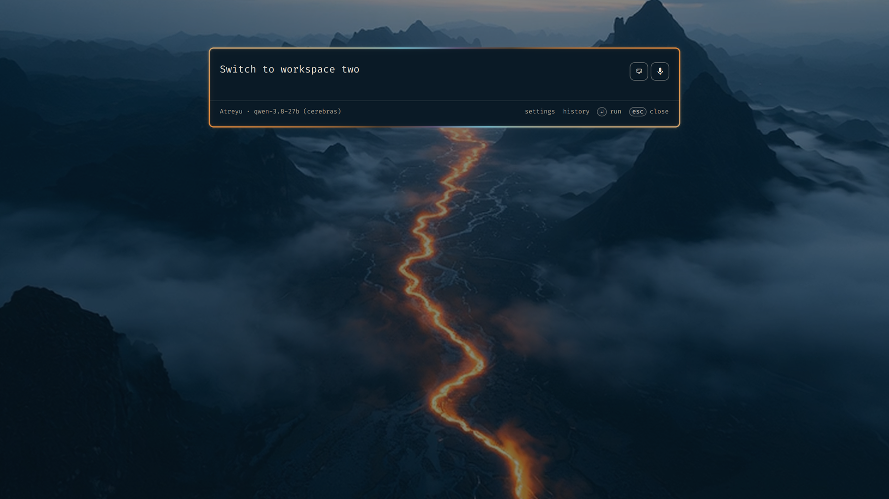

# Atreyu — an Omarchy theme

A theme cut from the Atreyu launch film for Omarchy Quattro RS: a river of amber light winding through dark, misted mountains.
The background moves. It is a video wallpaper, played by Omarchy's OWE wallpaper engine, and it loops seamlessly.



## Install

```bash
omarchy theme install https://github.com/spencerbull/omarchy-atreyu-theme
```

Then pick **Atreyu** from the theme menu (`Super + Ctrl + Shift + Space`) and choose a background with `Super + Ctrl + Space`.
The animated valley costs more power than a still; the stills in `backgrounds/` are the same scene if you want quiet.

## Palette

Extracted with [Aether](https://github.com/bjarneo/aether) from the valley frame, then tuned by hand: the amber river is the accent,
the warm mist is the text, and the rest is the valley's steel blue over near-black navy.

| Role | Hex |
| --- | --- |
| background | `#0a1a26` |
| foreground | `#e9e2d5` |
| accent | `#ef9240` |
| muted | `#5a6a78` |
| red / green / yellow | `#e46b5e` / `#8fc99a` / `#f5c56b` |
| blue / magenta / cyan | `#7fa6c9` / `#b995c9` / `#7fc4d4` |

## Backgrounds

All of them are high-resolution renders, not upscaled thumbnails.

- `atreyu-valley.mp4` — the animated valley from the film's opening shot (2880×1800, ping-pong loop, ~10 s).
  Midjourney only renders video at 832×464, so this is a Real-ESRGAN 4× upscale of that clip, frame by frame.
- `atreyu-valley-canyon.jpg` — the river cutting through a dark canyon (closest to the moving one)
- `atreyu-valley-clouds.jpg` — the river seen from above the cloud deck
- `atreyu-valley-dusk.jpg` — last light on the ridges, lights in the valley floor
- `atreyu-valley-orbit.jpg` — the river from the edge of the sky

The stills are Midjourney HD renders at 2784×1744 (16:10).

Imagery generated with Midjourney V8 for the Atreyu launch. MIT licensed, do what you like with it.
